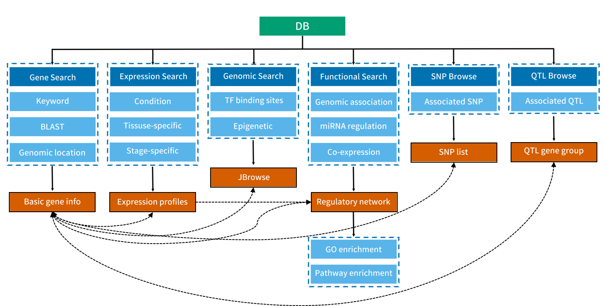
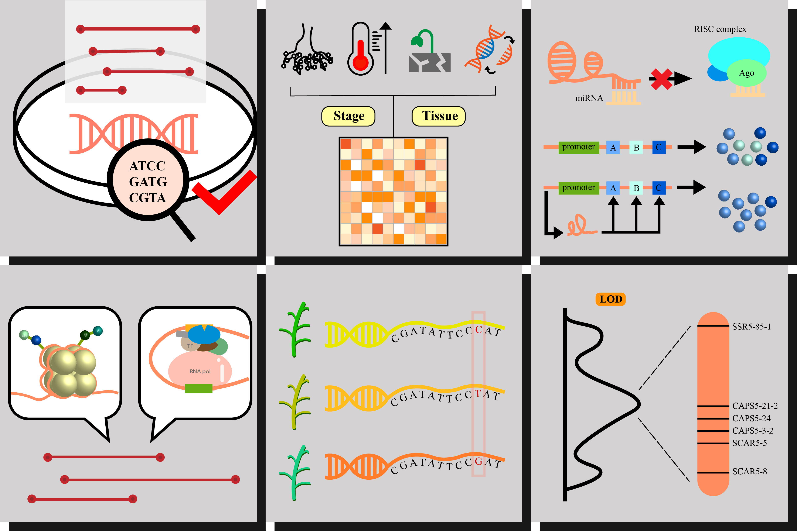
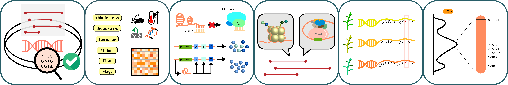
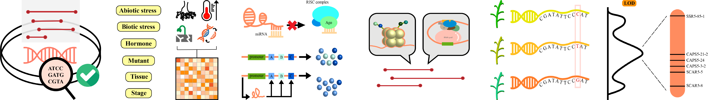

# lncRNA Database首頁
## 功能全覽圖
### ▪️ 網站功能架構

1. **Gene Search**: BLAST, associated gene in the genome(network-like), experiments varification
2. **Expression Search**: Tissue-specific, Stage-specific
3. **Genomic Browsing**: TF-binding sites, Epigenetic(Histone modification)
   > TAIR-like layout: 
   > - genome with exon, intron
   > - marker of modification 
4. **Functional Network**: miRNA regulation, co-expression
   
5. **SNP Browse**
6. **QTL Browse**: 數量基因座代表在genome上和此lncRNA相關的其他基因表現量。
<pre>SNP Browse and QTL Browse will be added in the future.</pre>

### ▪️ 全覽圖設計

Deadline: 2021.04.20

### Results

#### Version I

#### Version II

- 底圖更換成白底與#0C5D69邊框
- Gene search的勾勾更換

- 背景更改為透明
- 去邊框

### ▪️物種icon設計

| 物種        | 圖示                                          |
| ----------- | --------------------------------------------- |
| Arabidopsis |  |
| Maize       |              |
| Rice        |                |
| Medicago    |        |
| Tomato      |            |
| Soybean     |          |

