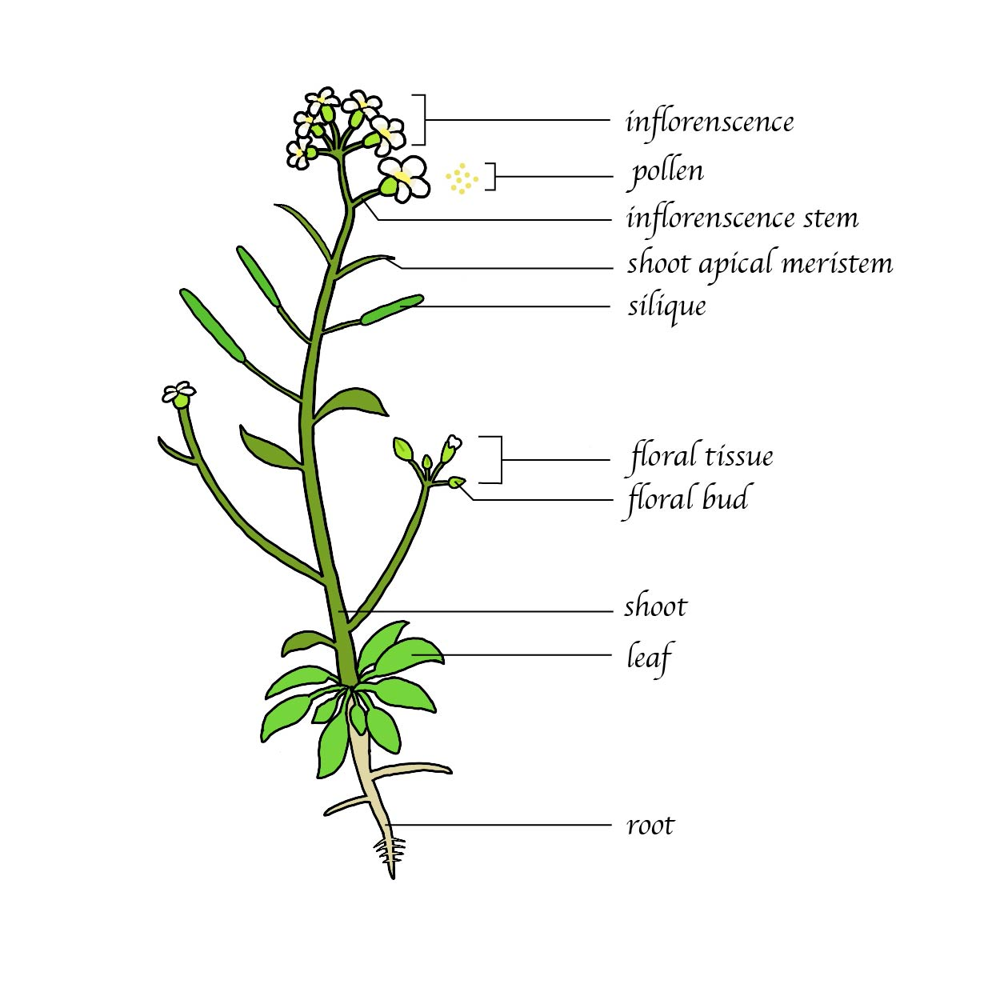

# lncRNA Database首頁
## 功能全覽圖
### 網站功能架構

1. **Gene Search**: BLAST, associated gene in the genome(network-like), experiments varification
2. **Expression Search**: Tissue-specific, Stage-specific
3. **Genomic Browsing**: TF-binding sites, Epigenetic(Histone modification)
   > TAIR-like layout: 
   > - genome with exon, intron
   > - marker of modification 
4. **Functional Network**: miRNA regulation, co-expression
   
5. **SNP Browse**
6. **QTL Browse**: 數量基因座代表在genome上和此lncRNA相關的其他基因表現量。
<pre>SNP Browse and QTL Browse will be added in the future.</pre>

### 全覽圖設計

Deadline: 2021.04.20

#### Results

##### Version I

##### Version II

- 底圖更換成白底與#0C5D69邊框
- Gene search的勾勾更換

- 背景更改為透明
- 去邊框

### 物種icon設計

詳情請洽 picture/Icons/

### 物種tissue設計
#### Arabidopsis

##### Including

- [ ] aerial part
- [ ] apical meristem
- [ ] embryos
- [x] floral bud
- [x] floral tissue
- [ ] hypocotyl tissue
- [x] inflorenscences
- [x] inflorescence stem
- [x] leaf
- [x] leaves
- [x] pollen
- [x] root
- [x] shoot
- [x] shoot apical meristem
- [x] siliques

##### Result

V1

##### Editing

> 改善鬚根的部分，應該更加擴散和鬚化，可以參考EFP browser。

#### Rice

##### Including

- [ ] leaf
- [ ] aerial  tissue
- [ ] Alurone  layer
- [ ] anthers 
- [ ] blade
- [ ] caryopsis
- [ ] Crown
- [ ] Endosperm
- [ ] Flag  leaf
- [ ] florets
- [ ] Flower
- [ ] Gall  tissue
- [ ] lamina  joint
- [ ] mature  egg isolated from ovule
- [ ] milkripe  seeds
- [ ] Nucellar  Epidermis
- [ ] Ovular  vascular trace
- [ ] panicles
- [ ] pistil
- [ ] Pollen
- [ ] Rice  spikelets
- [ ] root
- [ ] shoot
- [ ] shoot  base
- [ ] Stem
- [ ] unicellular  zygote

##### Result

##### Editing

#### Maize

##### Including

- [ ]  Fungal mycelia and maize stalk mixture
- [ ]  leaf apex
- [ ] anther
- [ ] ear
- [ ] tessels
- [ ] aerial
- [ ] aerial seedlings
- [ ] air side  of primary root
- [ ] aleurone
- [ ] Apical  Cell
- [ ] apical  scutellum
- [ ] Basal  Cell
- [ ] basal  endosperm transfer layer
- [ ] central  starchy endosperm
- [ ] coleoptyle
- [ ] conducting  zone
- [ ] ear  internode
- [ ] ear  primordia
- [ ] egg cell
- [ ] embryo
- [ ] endosperm
- [ ] endosperm  crown
- [ ] germinating  kernels
- [ ] growth  zone
- [ ] hypocotyl
- [ ] inner  layer husk
- [ ] maize  silk
- [ ] mature  female spikelets
- [ ] mature  pollen
- [ ] nucellus
- [ ] pericarp
- [ ] placento-chalazal  region
- [ ] root
- [ ] Root  cortex
- [ ] Root  elongation zone
- [ ] Root  maturation zone
- [ ] roothair
- [ ] shoot
- [ ] shoot  apical meristem
- [ ] sperm  cell
- [ ] stomatal  division zone
- [ ] symmetrical  division zone
- [ ] vascular  region of the pedicel
- [ ] Vegetative  Meristem & Surrounding Tissue
- [ ] Zygote

##### Result

##### Editing

#### Medicago

##### Including

- [ ]  2 trifoliate leaves
- [ ]  root nodule
- [ ] denodule  roots
- [ ] flowers
- [ ] hairy  roots
- [ ] leaves
- [ ] regenerated  root structure
- [ ] seedlings

##### Result

##### Editing

#### Soybean

##### Including

- [ ] Anther
- [ ] Axis  Epidermis
- [ ] Axis  Parenchyma
- [ ] Axis  Plumules
- [ ] Axis  Root Tip
- [ ] Axis  Shoot Apical Meristem
- [ ] Axis  Stele
- [ ] Axis  Vasculature
- [ ] Cotyledon
- [ ] Cotyledon  Abaxial Epidermis
- [ ] Cotyledon  Abaxial Parenchyma
- [ ] Cotyledon  Adaxial Epidermis
- [ ] Cotyledon  Adaxial Parenchyma
- [ ] Cotyledon  Vasculature
- [ ] embryo
- [ ] Endosperm
- [ ] floral  buds
- [ ] Flower
- [ ] lateral  roots
- [ ] leaves
- [ ] Nodule
- [ ] Ovary
- [ ] pod
- [ ] pod  shell
- [ ] seed
- [ ] Seed  Coat Endothelium
- [ ] Seed  Coat Epidermis
- [ ] Seed  Coat Hilum
- [ ] Seed  Coat Hourglass Cells
- [ ] Seed  Coat Inner Integument
- [ ] Seed  Coat Outer Integument
- [ ] Seed  Coat Palisade
- [ ] Seed  Coat Parenchyma
- [ ] stems
- [ ] Suspensor
- [ ] Unifoliolate  leaf
- [ ] Trifoliate  leaves

##### Result

##### Editing

#### Tomato

##### Including

- [ ] apical  meristem
- [ ] floral
- [ ] floral  bud
- [ ] fruit
- [ ] leaf
- [ ] Mature  pollen grain
- [ ] Microspore
- [ ] ovule
- [ ] pericarp
- [ ] Pistil
- [ ] root
- [ ] Root  (Differentiation zone)
- [ ] Root  (Elongation zone)
- [ ] Root  (Meristem)
- [ ] root tip
- [ ] seedlings
- [ ] shoot
- [ ] stem
- [ ] vegetative  meristem

##### Result

##### Editing

