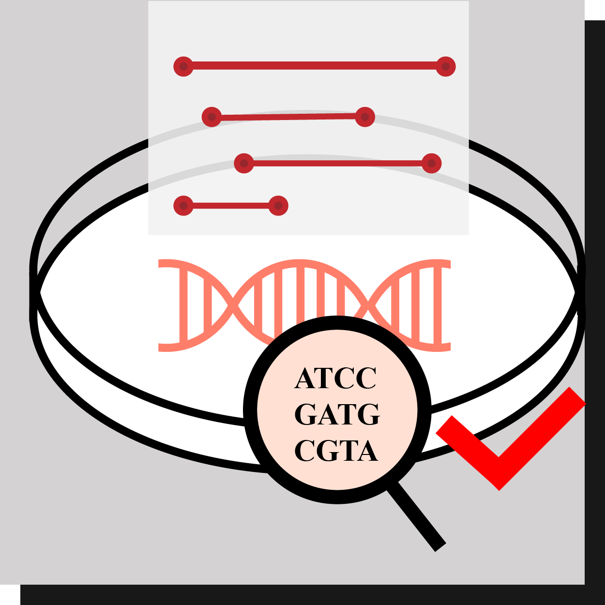
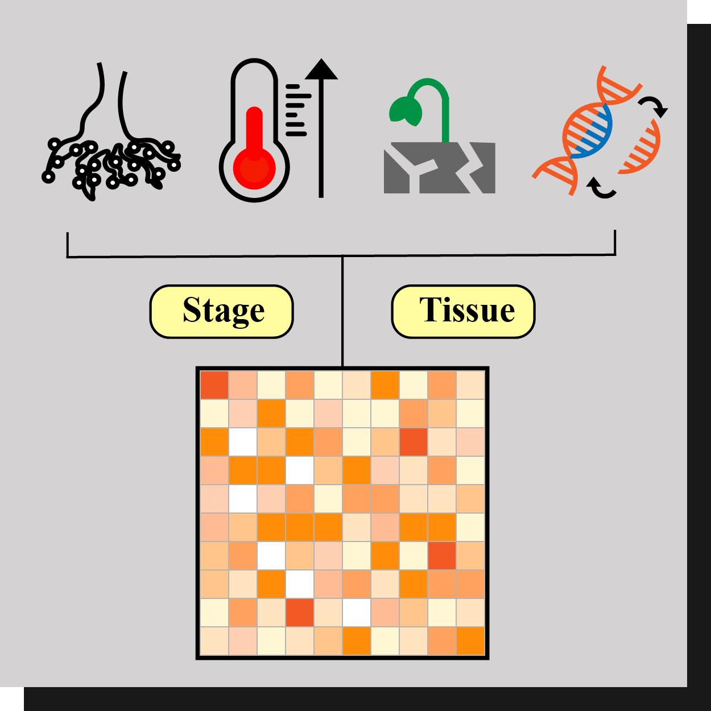

# lncRNA Database首頁
## 功能全覽圖
### ▪️ 網站功能架構

1. **Gene Search**: BLAST, associated gene in the genome(network-like), experiments varification
2. **Expression Search**: Tissue-specific, Stage-specific
3. **Genomic Browsing**: TF-binding sites, Epigenetic(Histone modification)
   > TAIR-like layout: 
   > - genome with exon, intron
   > - marker of modification 
4. **Functional Network**: miRNA regulation, co-expression
   
   > miRNA regulation指lncRNA會和Ago結合，但其序列和Ago active site的序列mismatch，故會影響其他miRNA作用。
5. **SNP Browse**
6. **QTL Browse**: 數量基因座代表在genome上和此lncRNA相關的其他基因表現量。
<pre>SNP Browse and QTL Browse will be added in the future.</pre>

### ▪️ 全覽圖設計
Version I
Deadline: 2021.04.20

- 設計風格：
  
  

- Logo底圖：
  - 淺灰為主，深灰為輔
  
  - 底圖大小：300*300px
  
  - Demo：
  
    
    

- Gene search

  

- Expression search

  

- Functional search

  

- Genomic search

  

- SNP browse

  

- QTL browse

  

整體：

